# CI/CD Evidences

## PR Checks / Quality Gates

[View workflow run](https://github.com/MarneusKalgar/rd_shop-backend/actions/runs/23309812125)

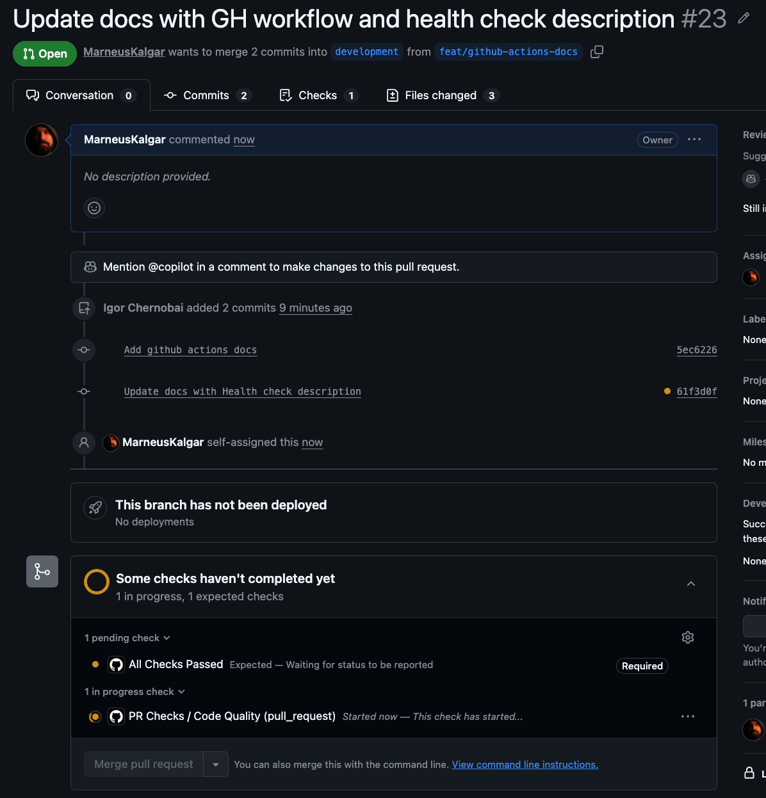
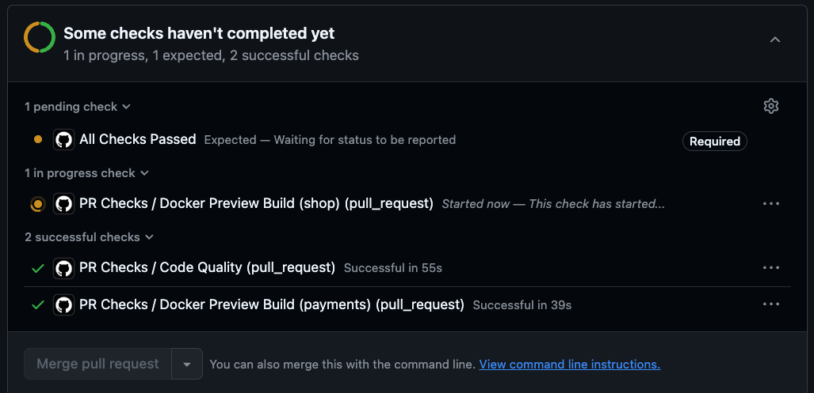
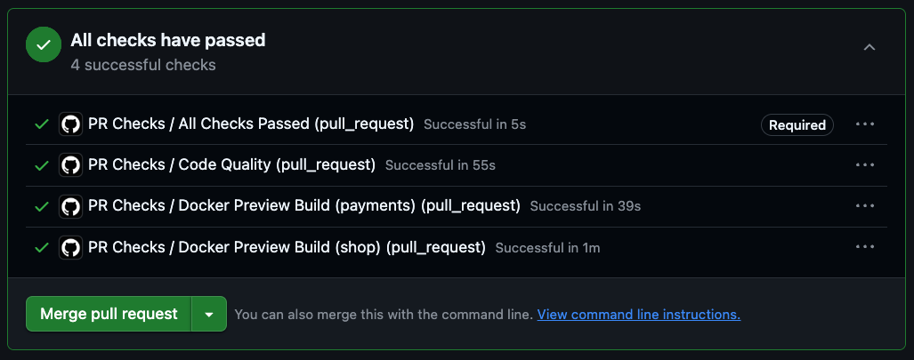
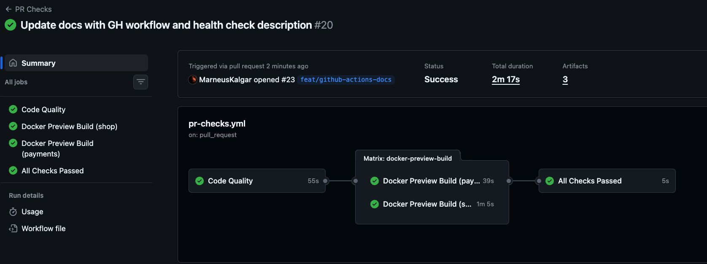
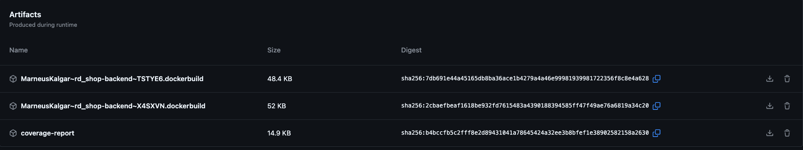

## Build and Push

[View workflow run](https://github.com/MarneusKalgar/rd_shop-backend/actions/runs/23310057763)

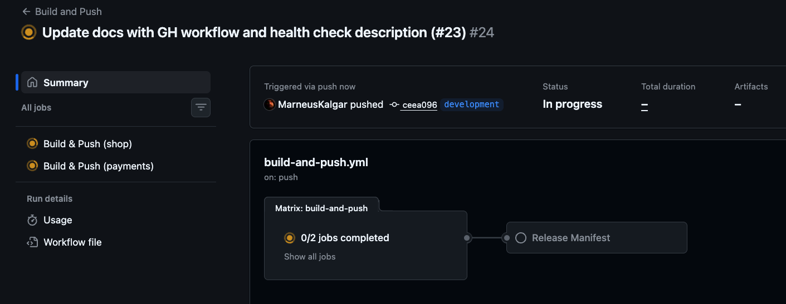
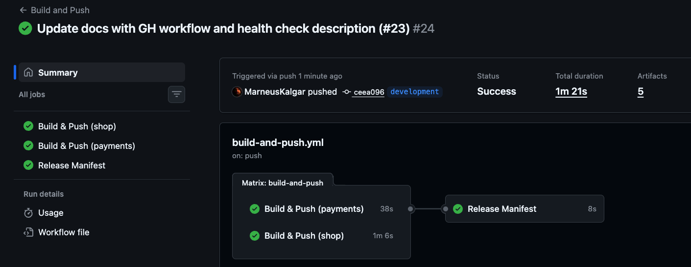

## Deploy Stage

[View workflow run](https://github.com/MarneusKalgar/rd_shop-backend/actions/runs/23310115420)

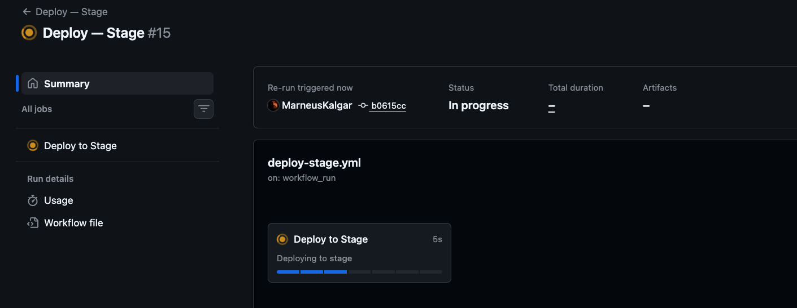
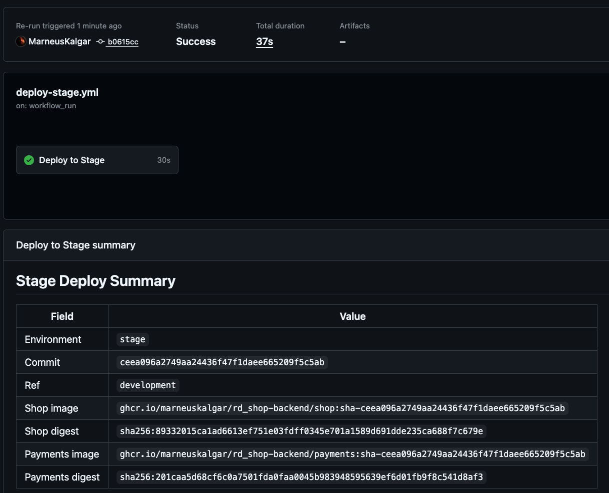

## Deploy Prod

[View workflow run](https://github.com/MarneusKalgar/rd_shop-backend/actions/runs/23310532452)

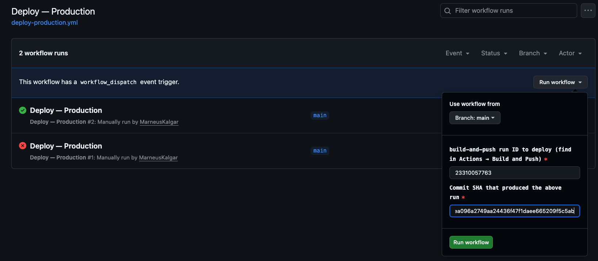
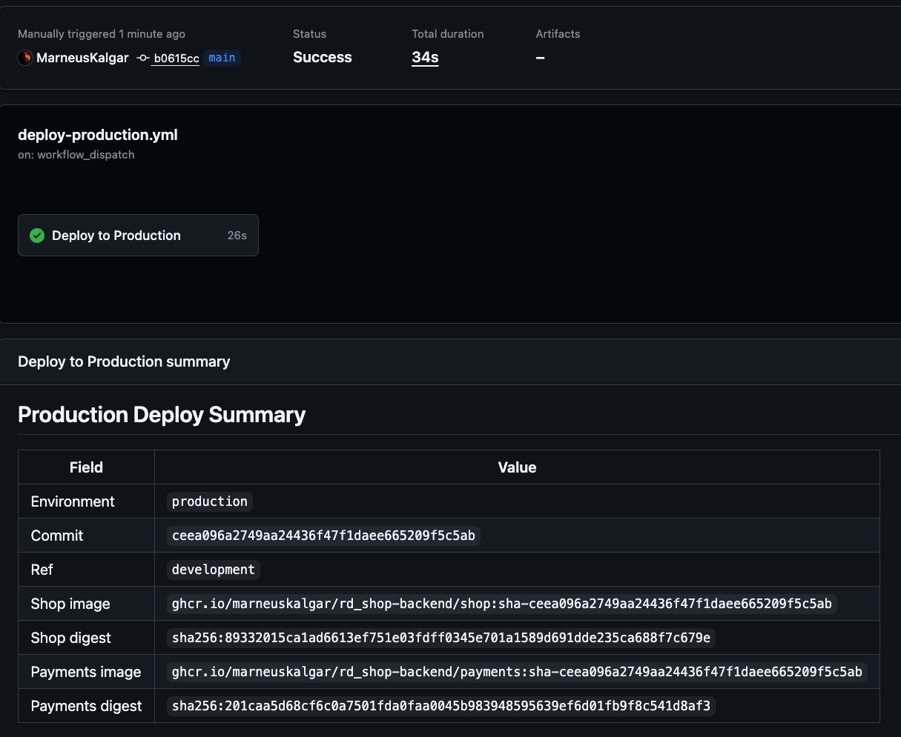

## Deployment Targets

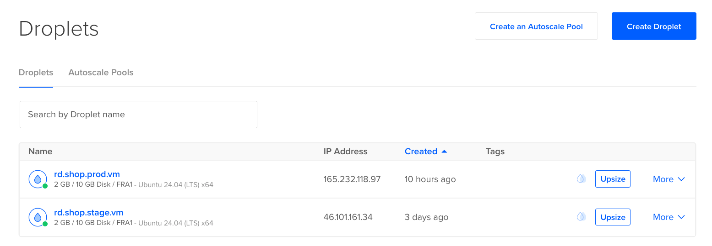

## Branch Protection

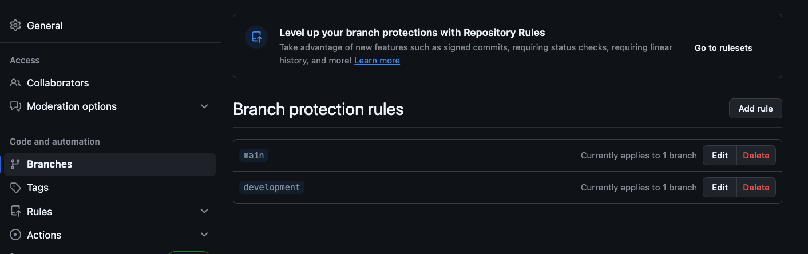
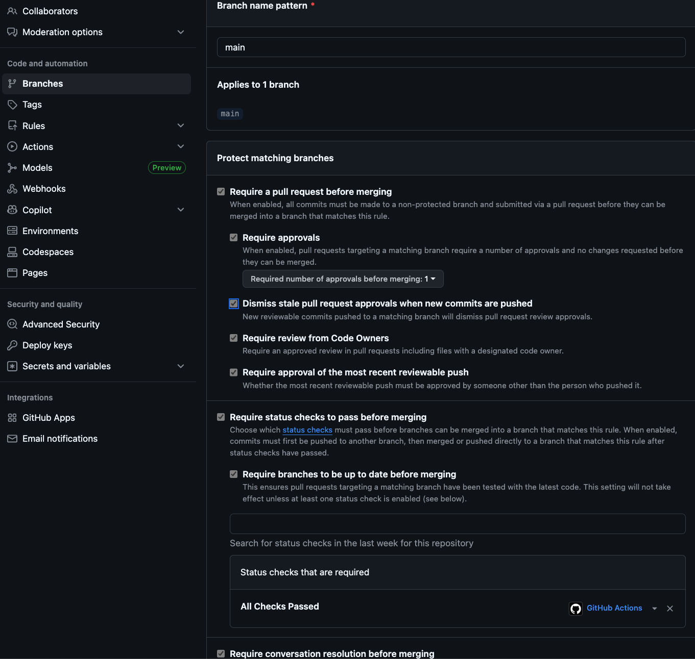
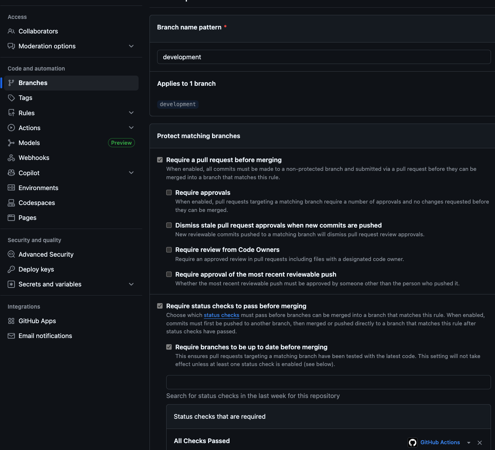
