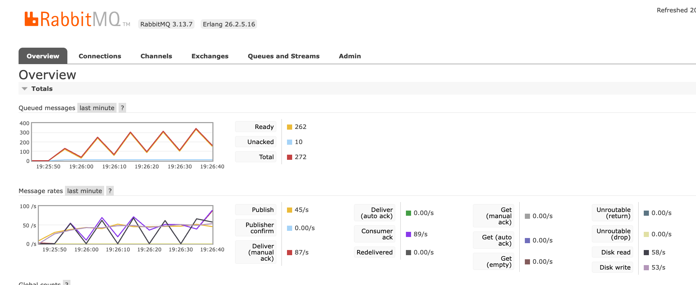
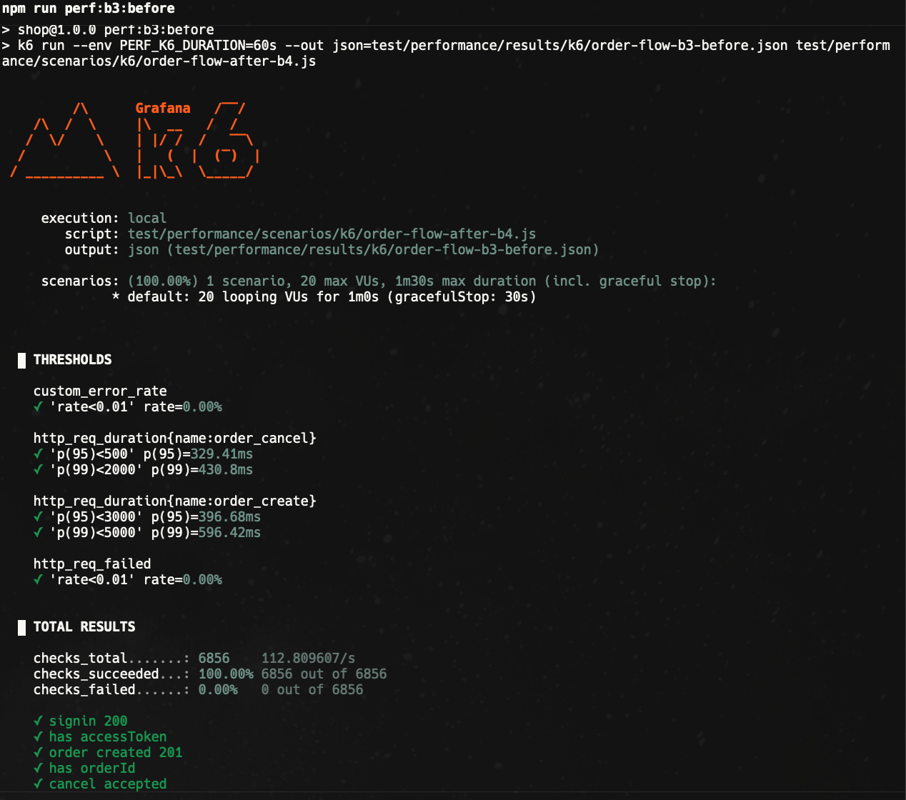
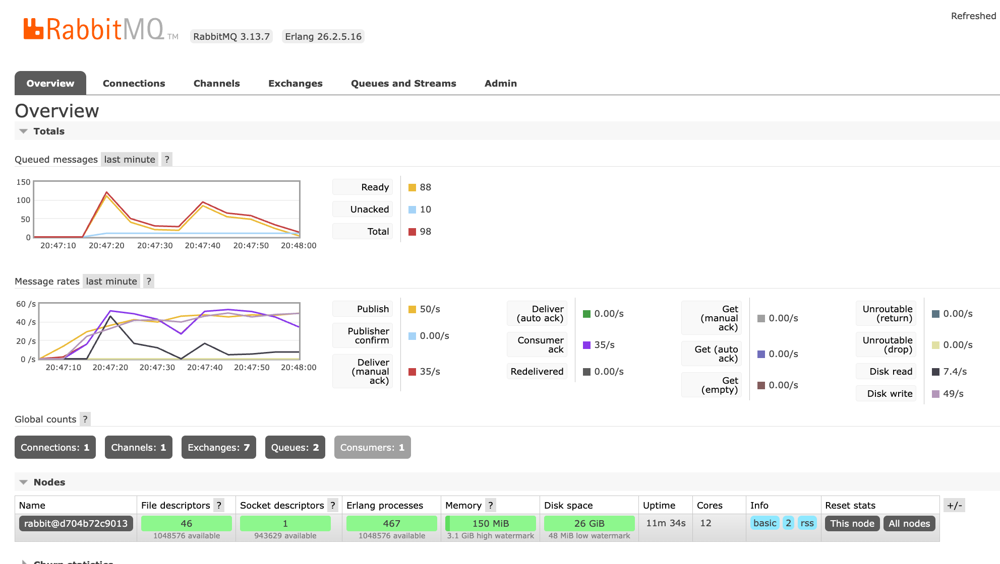
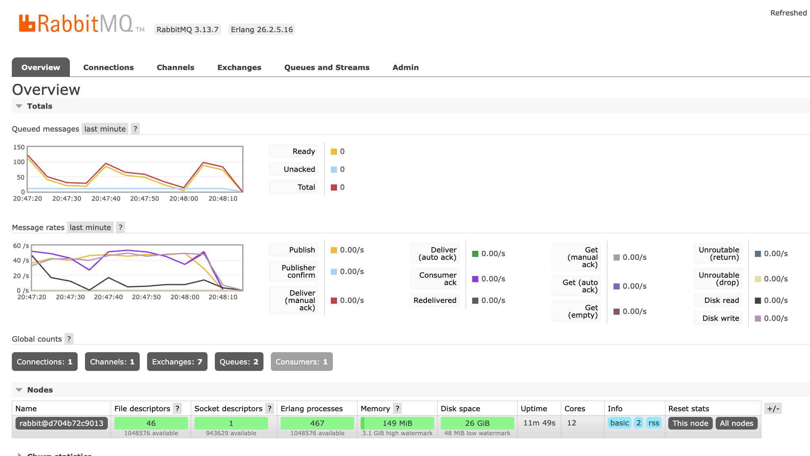
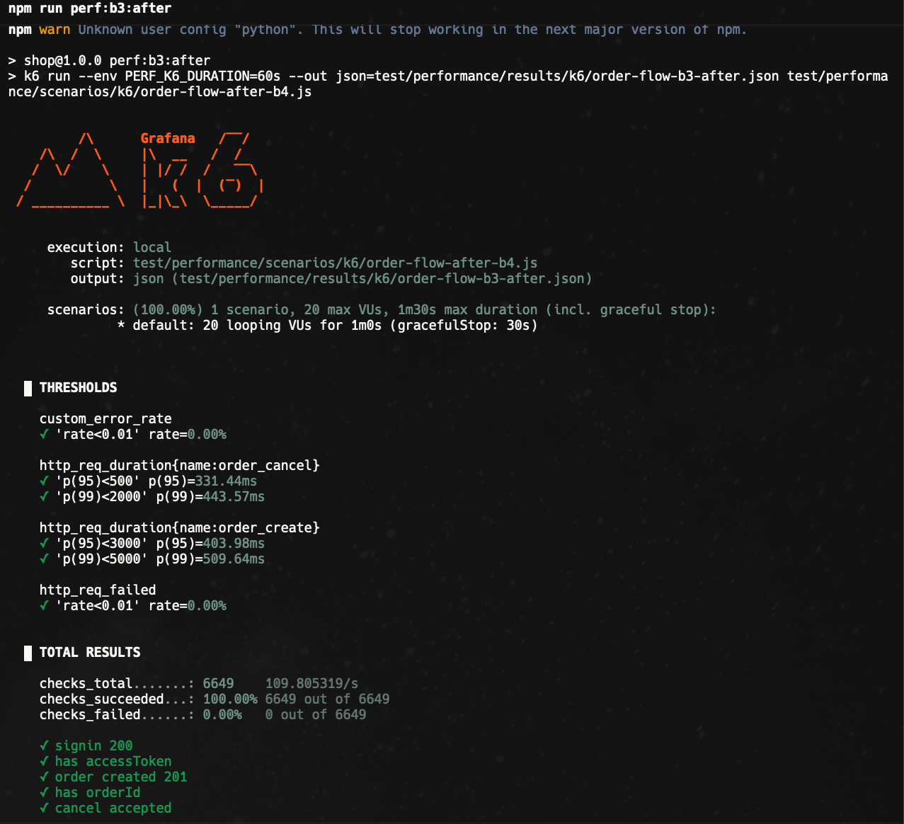

# Homework — Performance Optimization Report

**Before/After data table:** [performance-evidences/before-after-table.md](performance-evidences/before-after-table.md)  
**Screenshots (circuit breaker):** [performance-evidences/](performance-evidences/)  
**Detailed plan & runbooks:** [docs/backend/requirements/performance-plan.md](docs/backend/requirements/performance-plan.md)

---

## Part 1 — Baseline

### Hot scenario selected: Order Flow

The order flow was chosen as the primary hot scenario because it is the critical business path:
`POST /auth/signin` → `POST /api/v1/cart/checkout` (order create) → `DELETE /api/v1/orders/:id` (order cancel).
It exercises DB transactions with pessimistic locking, RabbitMQ publishing, and auth token ops — the highest-impact combination of work per request.

**Secondary scenario:** `GET /api/v1/products?search=` with trigram search — highest read throughput endpoint, N=10K products.

**Environment:** `compose.perf.yml` — isolated Docker Compose stack.  
Constraints: `shop-perf` limited to **0.5 vCPU / 512 MiB** via `deploy.resources.limits` (simulates t3.micro ECS task).

### Baseline (Tier 2 — k6, captured 2026-04-12)

| Metric                   | Product Search (50 VUs, 30 s)                   | Order Flow (20 VUs, 30 s)                 | Auth Refresh (30 VUs, 30 s) |
| ------------------------ | ----------------------------------------------- | ----------------------------------------- | --------------------------- |
| p50 latency              | ~75 ms                                          | ~180 ms                                   | ~6 000 ms                   |
| p95 latency              | **293 ms**                                      | **384 ms** (create) / **218 ms** (cancel) | **26 380 ms** ❌            |
| p99 latency              | **402 ms**                                      | **1 797 ms** (create)                     | **~31 600 ms**              |
| CPU (shop-perf)          | ~50 % (sustained, at CFS ceiling)               | ~50 %                                     | ~50 %                       |
| Memory (RSS)             | ~108 MiB                                        | ~111 MiB                                  | ~92 MiB                     |
| Event loop lag p99       | ~108 ms (all 7 samples exceed 100 ms threshold) | ~398 ms (burst at t=0)                    | ~191 ms (8/8 samples)       |
| Error rate               | 0.00 %                                          | 0.00 %                                    | 0.00 %                      |
| Throughput               | 161 iter/s                                      | 29.5 iter/s                               | 1.6 iter/s                  |
| DB scan (product search) | Seq Scan — 5 SQL calls per search               | ~17 SQL / order create                    | —                           |

---

## Part 2 — Bottleneck Analysis

### Bottleneck 1 (A1): Sequential Scan on Product Search

**What:** `GET /api/v1/products?search=` used `ILIKE '%term%'` with **no index**. PostgreSQL performed a full sequential scan across all products on every search request.

**Evidence:** `EXPLAIN ANALYZE` showed `Seq Scan on product` with `rows=10000`. `pg_stat_statements` confirmed 5 SQL calls per search request (duplicate queries). At 50 VUs the DB CPU saturated first.

**Data:** p95 293 ms, 161 iter/s, `Seq Scan` in every query plan, event loop threshold exceeded on all 7 samples.

---

### Bottleneck 2 (A2): Cursor Pagination — Extra DB Round-Trip per Page

**What:** `ProductsRepository.findWithFilters()` and `OrdersQueryBuilderService` resolved the cursor by calling `findOne({ where: { id: cursor } })` before building the paginated query — **2 DB round-trips per paginated page** instead of 1.

**Evidence:** Tier 1 (Testcontainers + `pg_stat_statements`) confirmed 2 queries per page 2/3 request before fix, 1 after.

---

### Bottleneck 3 (A3/B4): Order Create/Cancel — Unnecessary Queries Inside Transactions

**What (A3):** `executeOrderTransaction()` called `findOne({ relations: ['items', 'items.product', 'user'] })` inside the open transaction that held pessimistic locks — a 4-table JOIN under lock, extending lock duration.

**What (B4):** `cancelOrder()` loaded `relations: ['items', 'items.product']` unconditionally upfront, even for requests that were rejected immediately (wrong status) without touching items.

**Evidence:** Tier 1 `pg_stat_statements` confirmed the re-fetch SELECT and the JOIN on cancel. Order create p99 was 1 797 ms — lock contention was the dominant tail source.

---

### Bottleneck 4 (B1 / B5): bcrypt Blocking Event Loop on Auth Path

**What:** Native `bcrypt` (B1) ran on the Node.js thread pool, but each hash (~100 ms at 10 rounds) blocked other I/O when multiple VUs ran simultaneously. Refresh token path (B5) used bcrypt again for token hashing — but refresh tokens have 512-bit randomness, making the cost-of-hashing provide zero security benefit (brute force is infeasible regardless of hash speed).

**Evidence:** Auth refresh p95 was 26 380 ms ❌ at 30 VUs. Event loop threshold (100 ms) exceeded in 8/8 samples. `clinic.js` / log patterns confirmed bcrypt thread-pool saturation.

---

### Bottleneck 5 (B3): No Circuit Breaker on gRPC Payments Call

**What:** `PaymentsGrpcService` had a 5 s timeout on the gRPC call but no circuit breaker. When the payments service was unavailable, every RabbitMQ message consumed from the queue blocked a prefetch slot for 5 s waiting for the timeout, then was nacked and requeued — creating a **21 s stall cycle per 10-message prefetch batch**.

**Evidence:** RabbitMQ management UI showed queue depth growing at **+33 msg/s** net even at 45 pub/s, with consumer ack rate at only ~12/s. Container logs showed `Payment authorization timed out after 5000ms` firing in bursts of 10 every ~20 s. Queue never drained — it grew for the entire 60 s test run (peak depth ~272 ready messages). CPU sustained at ~50 % with a **999 ms event loop spike** caused by 10 simultaneous timeout completions.

---

## Part 3 — Implemented Improvements

### 3.1 Performance Improvements

#### A1 — GIN Trigram Index on Product Search

Replaced `ILIKE '%term%'` with `pg_trgm` GIN index + `%` operator:

```sql
CREATE INDEX idx_products_name_trgm ON products USING GIN (name gin_trgm_ops);
CREATE INDEX idx_products_description_trgm ON products USING GIN (description gin_trgm_ops);
```

SQL calls per search: **5 → 1**. Query plan: `Seq Scan → Bitmap Index Scan via GIN`.

#### A2 — Cursor Decoded In-Memory (No Extra DB Round-Trip)

Cursor format changed from opaque ID (requiring `findOne` lookup) to `id|epochMs`:

```typescript
// Before: 2 queries (findOne cursor + paginated query)
// After: 1 query — cursor decoded in-process from "uuid|1713360000000"
export function decodeCursor(cursor: string): { id: string; sortValue: number };
```

SQL calls per paginated page: **2 → 1**.

#### A3 — Remove Post-INSERT Re-fetch Inside Transaction

Built response from in-memory entities already available in the transaction context instead of re-querying with a 4-table JOIN:

```typescript
// Removed: await this.ordersRepository.findByIdWithRelations(order.id, manager)
// Now: assemble order.items + order.user from variables already in scope
```

#### B4 — Conditional Relation Loading on Order Cancel

Split `cancelOrder()` into two phases — status-only SELECT first, items+products SELECT only if cancellation proceeds:

```typescript
// Phase 1: SELECT id, status WHERE id = :id  (no JOIN)
// Phase 2: SELECT ... JOIN items, products  (only on PENDING → CANCELLED path)
```

#### B3 — Circuit Breaker on gRPC Payments (`opossum`)

Wrapped `PaymentsGrpcService.authorize()` with an `opossum` circuit breaker:

- Opens after 5 consecutive failures (50 % error threshold, volumeThreshold 5)
- Half-open after 10 s reset timeout
- OPEN state: messages nack instantly (fast-fail) instead of blocking 5 s per message

```typescript
this.authorizeBreaker = new CircuitBreaker(authorizeWithTimeout, {
  timeout: 5000,
  errorThresholdPercentage: 50,
  resetTimeout: 10_000,
  volumeThreshold: 5,
});
```

### 3.2 Cost / Runtime Improvements

#### B5 — HMAC-SHA256 for Opaque Token Hashing

Replaced bcrypt token hashing in `TokenService` with HMAC-SHA256 keyed on `TOKEN_HMAC_SECRET`:

```typescript
// Before: await bcrypt.hash(rawSecret, saltRounds)  — ~100 ms, thread pool
// After:  crypto.createHmac('sha256', hmacSecret).update(rawSecret).digest('hex')  — ~1 µs, sync
```

bcrypt is correct for **passwords** (low entropy). Opaque tokens use `crypto.randomBytes(64)` (512-bit entropy) — bcrypt cost provides zero security benefit there. 5 token operations (signin, refresh, signout, verify-email, reset-password) all benefit. Password hashing in `AuthService`/`UsersService` is unchanged.

#### A4 — Explicit DB Connection Pool Size

Added `DB_POOL_SIZE` env var and wired it to TypeORM `extra.max`:

```typescript
extra: { max: poolSize, idleTimeoutMillis: 30_000, connectionTimeoutMillis: 5_000 }
```

Default pool was 10 (unverified). `DB_POOL_SIZE=5` in perf env — confirmed correct with Testcontainers `pg_stat_activity` assertion: 20 concurrent queries, max 5 active connections.

#### B2 — Graceful SIGTERM Handling

Added manual `process.on('SIGTERM', ...)` handler in `main.ts` calling `safeClose(app)`:

```typescript
process.on('SIGTERM', () => {
  void (async () => {
    await safeClose(app);
    process.exit(0);
  })();
});
```

Before: exit code 143 (SIGTERM default, no handler, no `app.close()`). After: exit code 0 (TypeORM pool drain + RabbitMQ consumer stop via `OnModuleDestroy` lifecycle hooks).

---

## Part 4 — Before / After

Full tables with all metrics per scenario: **[performance-evidences/before-after-table.md](performance-evidences/before-after-table.md)**

### Summary

| Optimisation           | Category     | Primary metric              | Before           | After                 | Δ                 |
| ---------------------- | ------------ | --------------------------- | ---------------- | --------------------- | ----------------- |
| A1 — GIN trigram index | Performance  | product search p95          | 293 ms           | **216 ms**            | −26 %             |
| A1 — GIN trigram index | Performance  | DB scan calls               | 5                | **1**                 | −80 %             |
| A1 (unconstrained)     | Performance  | product search p95          | 293 ms           | **5.44 ms**           | **−98 %**         |
| A1 — GIN trigram index | Performance  | throughput                  | 161 iter/s       | **195 iter/s**        | +21 %             |
| A2 — cursor decode     | Performance  | DB calls / page 2           | 2                | **1**                 | −50 %             |
| A3 — no re-fetch       | Performance  | order create p95            | 384 ms           | **307 ms**            | −20 %             |
| A3 — no re-fetch       | Performance  | order create p99            | 1 797 ms         | **726 ms**            | **−60 %**         |
| B4 — cond. loading     | Performance  | order cancel p95            | 218 ms           | **164 ms**            | −25 %             |
| B5 — HMAC tokens       | Cost/runtime | token op cost               | ~100 ms (bcrypt) | **~1 µs**             | **−99.999 %**     |
| B5 — HMAC tokens       | Cost/runtime | refresh p99 (k6)            | 25 310 ms        | **20 110 ms**         | −21 %             |
| B1 — bcryptjs          | Cost/runtime | signin p95                  | 6 230 ms         | **5 150 ms**          | −17 %             |
| B1 — bcryptjs          | Cost/runtime | event loop spikes (refresh) | 8/8 samples      | **4/9 samples**       | −50 % frequency   |
| A4 — pool size         | Cost/runtime | max DB connections          | 10 (unverified)  | **5 (enforced)**      | −50 % connections |
| B2 — SIGTERM handler   | Cost/runtime | container exit code         | 143 (hard)       | **0** (clean)         | ✅                |
| B3 — circuit breaker   | Cost/runtime | worker stall per msg        | **~21 s**        | **~0 ms** (fast-fail) | −100 % stall      |
| B3 — circuit breaker   | Cost/runtime | queue at end of run         | **growing**      | **0 — fully drained** | ✅                |
| B3 — circuit breaker   | Cost/runtime | consumer ack rate           | 12/s             | **51/s**              | +325 %            |

### Circuit Breaker Evidence (B3)

**Before — queue backing up under gRPC outage:**





Queue depth grows at +33 msg/s net. Consumer ack rate 12/s. Queue never drains.

**After — circuit breaker opens, queue drains:**








After the breaker opens (5 timeout failures): consumer ack rate jumps to 51/s (matches publish), queue clears to 0 within ~10 s after k6 stops. CPU drops from 50 % sustained → 18 % → <1 % (no zombie retry loops). HTTP p95/p99 is unchanged — the async payment path is invisible to the HTTP client.

---

## Part 5 — Trade-offs and Production Thinking

**A1 (GIN trigram index):** Search p95 dropped −26 % (constrained) / −98 % (unconstrained). The trade-off is a ~10 MB index per 10K products and slower inserts/updates on the `products` table (~1–2 ms extra per write). Acceptable: product catalog is read-heavy, write-rare. In production, monitor `pg_stat_user_indexes.idx_scan` to confirm index is being used and watch `autovacuum` on the products table.

**A2 (cursor pagination):** Eliminated one DB round-trip per paginated page. The cursor format (`uuid|epochMs`) is semi-opaque — clients can decode it, but no sensitive data is exposed. The real risk is cursor invalidation: if `createdAt` precision differs between environments or the sort key changes, cursors from one version may fail on another. Monitor `4xx` rates on paginated endpoints after deploys.

**A3/B4 (reduced queries under lock):** Removing the post-INSERT re-fetch cut order create p99 by 60 %. The trade-off is slightly more complex assembly code. On B4, splitting the cancel into two phases means two DB round-trips on the success path (was one); the gain is eliminating the JOIN on the far more common rejected-cancel path.

**B1/B5 (bcrypt → bcryptjs + HMAC tokens):** Bcryptjs is ~5 % slower per-hash than native bcrypt but non-blocking. HMAC-SHA256 for opaque tokens is essentially free (~1 µs). The critical trade-off in B5 is the **migration break**: all existing refresh/verification/reset tokens in DB have bcrypt hashes. After deploy they all fail HMAC comparison → users re-authenticate. Acceptable with a release note. Production monitoring: track 401 rate on `/auth/refresh` in the 15 min window after deploy; expect a spike then normalisation.

**B3 (circuit breaker):** The circuit breaker eliminates zombie retry loops when payments-gRPC is down. Trade-off: it introduces a new failure mode — `CircuitBreakerOpenException` — that must be handled distinctly from a gRPC error. Orders in the window before the breaker opens still stall for 5 s. Monitor breaker state transitions via log pattern `"circuit breaker → OPEN"` and alert on it; a breaker opening in production means the payments service is degraded. Also monitor `messages_unacknowledged` in RabbitMQ — if it grows under normal operation, the breaker thresholds need tuning.

**A4 (explicit pool size):** Enforcing `DB_POOL_SIZE=5` eliminates silent over-provisioning. The risk is under-provisioning under burst: if >5 concurrent DB queries arrive, later ones queue. For production, tune per environment: dev=5, staging=10, production=15–20. Monitor `pg_stat_activity` `wait_event_type = 'Client'` for connection queue pressure.

**B2 (SIGTERM handler):** Clean shutdown eliminates in-flight request loss and DB connection leaks during rolling deploys. Trade-off: shutdown now takes up to `gracefulShutdownTimeout` (8 s prod, 10 s dev) instead of ~0.4 s. ECS rolling deploy timeout must exceed this. Monitor container exit codes in CloudWatch: code 137 (SIGKILL) means the handler is taking longer than `docker stop --timeout`.

---

## Acceptance Criteria Verification

| Criterion                                 | Status | Evidence                                                                                               |
| ----------------------------------------- | ------ | ------------------------------------------------------------------------------------------------------ |
| One clearly selected hot scenario         | ✅     | Order flow + product search; described in Part 1                                                       |
| Baseline for key metrics                  | ✅     | k6 p50/p95/p99, CPU, memory, event loop lag, throughput — Part 1 table                                 |
| Bottleneck described                      | ✅     | 5 bottlenecks identified — Part 2                                                                      |
| Bottleneck confirmed by data              | ✅     | EXPLAIN ANALYZE, pg_stat_statements, k6 results, RabbitMQ UI, container logs                           |
| At least 2 targeted changes               | ✅     | 8 changes: A1, A2, A3, A4, B1, B2, B3, B4/B5                                                           |
| At least 1 performance improvement        | ✅     | A1 (−26 % search p95, −80 % DB calls), A3 (−60 % order create p99)                                     |
| At least 1 cost/runtime improvement       | ✅     | B5 (−99.999 % token op cost), B3 (queue drain + CPU drop), A4 (pool size enforced)                     |
| Before/after table                        | ✅     | [performance-evidences/before-after-table.md](performance-evidences/before-after-table.md)             |
| Real effect visible                       | ✅     | Numbers above + screenshots for B3 (circuit breaker)                                                   |
| Optimization does not break main scenario | ✅     | Error rate = 0.00 % in all after-state k6 runs                                                         |
| Trade-offs explained                      | ✅     | Part 5                                                                                                 |
| Economic effect                           | ✅     | B5 removes bcrypt CPU from all 5 token paths; A4 halves DB connections; B3 eliminates zombie retry CPU |
| README/homework-report.md present         | ✅     | This file; README updated with link                                                                    |
